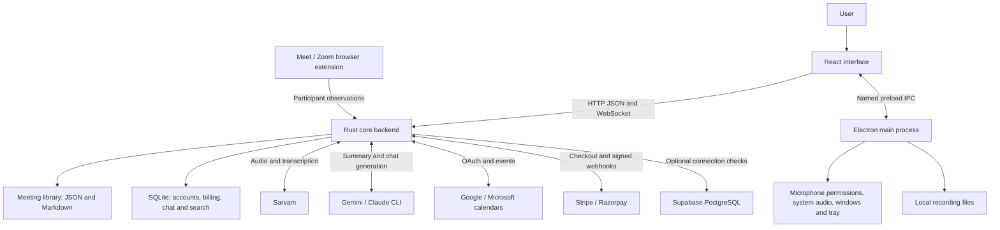
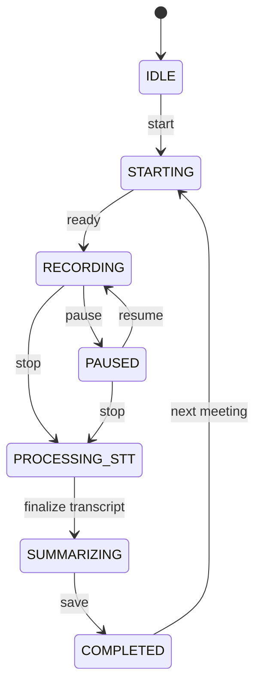
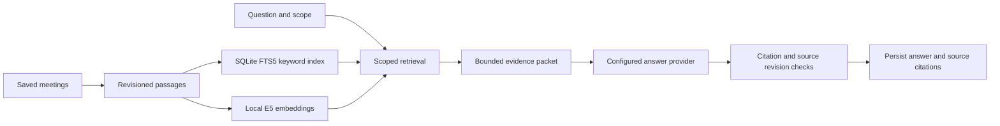

# Kesami Meeting Assistant — Project Architecture

Source snapshot: 19 September 2026. This document describes the current working tree, including the in-progress billing implementation. It is a source-level architecture map, not a claim that every integration has been deployed or verified live.

## 1. System overview

Kesami is a desktop meeting assistant built as an npm workspace. React provides the interface, Electron owns operating-system integration and recording files, and a Rust service owns meeting sessions, transcription, summaries, search, accounts, and persistence.

The default backend address is `http://127.0.0.1:48900`; its WebSocket endpoint is `/ws`. The UI can also be configured to use a remote HTTPS backend, with capability restrictions described below.



Three boundaries are central:

- The renderer uses HTTP/WebSocket for backend features and a narrow Electron preload bridge for OS features.
- Meeting capture and media files are local to the desktop. Provider-backed transcription and AI generation send their respective audio or text inputs to the configured provider.
- One backend currently has one active meeting session and one shared meeting library. Accounts do not create isolated tenant workspaces.

## 2. Repository map

| Location | Responsibility |
| --- | --- |
| [apps/ui](apps/ui) | React application, widget renderer, capture orchestration, backend clients, views and styles. |
| [apps/desktop](apps/desktop) | Electron lifecycle, preload bridges, media persistence, system audio, tray, Dock, widget and Google sign-in. |
| [apps/core-backend/src/main.rs](apps/core-backend/src/main.rs) | Rust entry point, application state, HTTP routing, WebSocket handling and meeting lifecycle. |
| [apps/core-backend/src/lib.rs](apps/core-backend/src/lib.rs) | Audio packet framing, voice activity detection, transcript cleanup and exported DSP modules. |
| [apps/core-backend/src/chat](apps/core-backend/src/chat) | Local retrieval index, embeddings, evidence validation and chat threads. |
| [apps/extension](apps/extension) | Browser extension observing Google Meet and Zoom participant names and call state. |
| [test](test) | Node test suites, integration tests and Electron/UI fixture harnesses. |
| [docs](docs) | Setup notes, detailed chat architecture and historical product plans. |
| [apps/core-backend/src/bin/kesami-cloud-relay.rs](apps/core-backend/src/bin/kesami-cloud-relay.rs) | Hosted provider relay: verifies Supabase sessions, then proxies Sarvam realtime and Gemini with server-held keys. Builds alone with `--no-default-features`. |
| `ultrademo-workspace/` | Separate auxiliary workspace present in this checkout; not part of the main `apps/*` runtime architecture. |

## 3. Frontend architecture

### Stack and entry points

The UI uses React 19, Vite 5, Tailwind CSS 3, Radix/Shadcn-style primitives, and Lucide icons. Application code is JavaScript/JSX. There is no Redux store or URL router driving the primary workspace; React hooks and component state own navigation and application state.

- [main.jsx](apps/ui/src/main.jsx) boots the main renderer.
- [App.jsx](apps/ui/src/App.jsx) restores authentication/local mode, coordinates the meeting hooks, handles navigation and shell commands, and opens settings, export and new-meeting dialogs.
- [DesignWorkspace.jsx](apps/ui/src/components/design/DesignWorkspace.jsx) is the active workspace composition, including meeting details, history and Ask AI surfaces.
- [widget.jsx](apps/ui/src/widget.jsx) is the separate floating-widget renderer.
- [vite.config.js](apps/ui/vite.config.js) builds both `index.html` and `widget.html`, uses relative asset paths for Electron `file://` loading, and defines the `@` source alias.

The Vite development port defaults to `5173`. Although proxy entries exist for `/api` and `/ws`, the central backend client normally constructs absolute URLs from the configured connection.

### State ownership

| Module | State and responsibility |
| --- | --- |
| [useMeetingSession.js](apps/ui/src/hooks/useMeetingSession.js) | Backend connection, meeting lifecycle, capture handles, audio levels, mute/pause state, settings, summary requests and meeting events. |
| [useTranscriptStream.js](apps/ui/src/hooks/useTranscriptStream.js) | Live transcript accumulation and replacement. |
| [useMeetingHistory.js](apps/ui/src/hooks/useMeetingHistory.js) | Saved meetings, library operations and folders. |
| [useMeetingChat.js](apps/ui/src/hooks/useMeetingChat.js) | Chat scope, threads, messages, requests, cancellation and source navigation. |
| [useCalendar.js](apps/ui/src/hooks/useCalendar.js) | Calendar connection status and event loading. |
| [usePreferences.js](apps/ui/src/hooks/usePreferences.js) | UI preferences such as workspace/display identity. |
| `useMeetingReminder`, `useUnscheduledCallPrompt`, `useShellCommands` | Scheduled reminders, detected-call prompts and desktop menu commands. |

`App` passes state and callbacks into the workspace. Heavy capture operations live in hooks and capture helpers, outside React render functions. Dialogs are lazily imported.

### Backend client boundary

[connection.js](apps/ui/src/lib/connection.js) resolves the backend URL from an optional `kesamiConnection` bridge, browser storage, `VITE_BACKEND_URL`, or the loopback default. Remote URLs must use HTTPS. It supplies bearer headers and WebSocket subprotocol authentication.

[backend.js](apps/ui/src/lib/backend.js) provides `apiRequest`, `apiText`, WebSocket reconnect behavior, binary audio encoding, backend-state mapping and transcript normalization. Other feature clients should use these utilities to keep connection and authentication behavior consistent.

The optional `kesamiConnection` interface is consumed by the UI but is not exposed by the current desktop `preload.js`. In that shell, the client falls back to browser storage: URL in local storage and token in session storage. Do not assume desktop token encryption/persistence is implemented from the frontend abstraction alone.

### Main presentation modules

- `components/design/`: workspace, meeting detail, sign-in, account security and pricing views.
- `MeetingChatPanel`, `ResizableChatPanel`, `SourceChip`: Ask AI and navigable evidence.
- `TranscriptView`, `LiveNotes`, `SummaryEditor`, `RecordingPlayer`: transcript, notes, summary and playback surfaces.
- `SettingsModal`, `SourcePicker`, `NewMeetingModal`, `ExportModal`: explicit user workflows.
- `components/ui/`: reusable Radix-based controls.
- `design.css`, `index.css`, `lib/theme.js`: visual system, shared styles and theme state.

Some older components remain in the tree; presence alone does not mean that `App` mounts them. Follow `App` → `DesignWorkspace` for the active interface.

## 4. Electron and native integration

[main.js](apps/desktop/main.js) is the desktop composition root. It registers recorder and shell handlers, initializes tray/Dock behavior, starts or reuses the backend, then opens the main and widget windows.

### Startup and shutdown

1. Probe the local `/health` endpoint and inspect build metadata before reusing an existing backend.
2. If needed, launch `target/release/kesami-core-backend`; fall back to `cargo run --release` when the binary is absent.
3. Pass the shared recording/library root and media-tool path to the backend.
4. Load the Vite URL in development or `apps/ui/dist/index.html` otherwise.
5. On shutdown, terminate the backend process owned by this shell; an externally started/reused backend is not owned by it.

The current shell still starts/probes a local backend even though the UI connection layer supports remote URLs. Remote client configuration and local process lifecycle are separate code paths.

### Preload interfaces

The main window enables `contextIsolation`, disables `nodeIntegration`, and currently sets `sandbox: false`. [preload.js](apps/desktop/preload.js) exposes named operations through `contextBridge`:

| Interface | Purpose |
| --- | --- |
| `kesamiRecorder` | List/select display sources, check permissions, open/write/close recordings, remove recording data, report usage and create playback URLs. |
| `kesamiSystemAudio` | Native system-audio availability, start/stop and PCM/status subscriptions. |
| `kesamiMicUsage` | Observe microphone use by other processes for unscheduled-call prompts. |
| `kesamiShell` | Widget visibility/state, recording indicator, menu commands and widget controls. |
| `kesamiGoogleSignIn` | Start the desktop Google OAuth sign-in flow. |

The widget has its own [widgetPreload.js](apps/desktop/widgetPreload.js) with a smaller interface. The renderer is not given unrestricted IPC or a Node module loader.

### Native and media modules

- [recorder.js](apps/desktop/recorder.js): source selection, chunked file writes, path validation and the `kesami-media://recordings/...` playback scheme.
- [systemAudio.js](apps/desktop/systemAudio.js): native system-audio helper lifecycle; bundled `SystemAudioDump` provides the macOS path.
- [micUsage.js](apps/desktop/micUsage.js) and `mic-watch/main.swift`: macOS microphone activity monitoring.
- [widget.js](apps/desktop/widget.js), [menubar.js](apps/desktop/menubar.js), [dock.js](apps/desktop/dock.js): desktop surfaces and application visibility.
- [googleSignIn.js](apps/desktop/googleSignIn.js): desktop OAuth interaction.

## 5. Rust backend architecture

The backend uses Tokio with a TCP listener and custom HTTP request parsing/routing in `main.rs`; it is not an Axum/Actix service. WebSockets use `tokio-tungstenite`. `reqwest` with rustls handles outbound HTTPS, `rusqlite` owns local SQLite databases, and `sqlx` provides optional PostgreSQL connectivity.

`AppState` shares services through `Arc`. The single active `Session` is protected by a Tokio mutex; library access uses locks; a broadcast channel distributes JSON events to WebSocket clients. Startup loads settings and credentials, applies provider preferences, loads the library/accounts/billing stores, starts chat indexing, and starts call-end supervision.

| Module | Responsibility |
| --- | --- |
| [main.rs](apps/core-backend/src/main.rs) | Request routing, session state machine, audio dispatch, transcript updates, completion and event delivery. |
| [library.rs](apps/core-backend/src/library.rs) | Per-meeting files, legacy import, library search, recording adoption and deletion. |
| [workspace.rs](apps/core-backend/src/workspace.rs) | Logical folders and meeting-folder assignment. |
| [settings.rs](apps/core-backend/src/settings.rs) | Allowed settings, separate credential storage, atomic writes and private permissions. |
| [sarvam_live.rs](apps/core-backend/src/sarvam_live.rs) | Realtime Sarvam speech-to-text connection and events. |
| [sarvam.rs](apps/core-backend/src/sarvam.rs) | Batch transcription, diarization and speaker mapping. |
| `dsp.rs`, `denoise.rs`, `echo.rs` | Audio processing, noise suppression and echo suppression. |
| `speakers.rs`, `voiceprint.rs` | Participant observations, speaker labels and voice matching. |
| [summarizer.rs](apps/core-backend/src/summarizer.rs) | Summary prompts, provider selection, model calls, structured outputs and fallback behavior; also provides chat-generation support. |
| [calendar.rs](apps/core-backend/src/calendar.rs) | Calendar OAuth, refresh, event normalization and Google event creation. |
| [accounts.rs](apps/core-backend/src/accounts.rs), [google_auth.rs](apps/core-backend/src/google_auth.rs) | Password/Google accounts, hashed sessions and identity verification. |
| [plans.rs](apps/core-backend/src/plans.rs), [billing.rs](apps/core-backend/src/billing.rs) | Plan catalog, allowances, provider checkout, signed webhook processing and subscription storage. |
| [security.rs](apps/core-backend/src/security.rs) | Host/origin rules, bearer/subprotocol tokens and request size limits. |
| [supabase.rs](apps/core-backend/src/supabase.rs) | Optional PostgreSQL pool, diagnostic connectivity checks, migrations, and the billing copy into Supabase. |
| [podcast.rs](apps/core-backend/src/podcast.rs) | Retained podcast implementation; public podcast routes are disabled. |

## 6. Recording and transcription flow

```mermaid
sequenceDiagram
    participant U as React UI
    participant E as Electron / capture helpers
    participant B as Rust backend
    participant S as Sarvam
    participant A as Summary provider
    participant D as Local library
    U->>B: POST /api/meetings/start
    B-->>U: Meeting and state events
    U->>E: Start microphone / system audio / optional screen capture
    loop While recording
        E-->>U: PCM and recording chunks
        U->>B: Binary audio over /ws
        B->>S: Realtime audio
        S-->>B: Transcript results
        B-->>U: Interim/final turns and audio levels
    end
    U->>E: Stop and finalize recording
    U->>B: POST /api/meetings/stop with recording metadata
    B->>S: Drain realtime results; optional local batch diarization
    opt Auto-summary enabled and account entitled
        B->>A: Transcript, notes and meeting context
        A-->>B: Structured summary
    end
    B->>D: Persist meeting, documents and adopted recording
    B-->>U: meeting_completed
```

### Capture sources

- `lib/micCapture.js` and `lib/pcmCapture.js` capture/resample microphone audio.
- `lib/systemCapture.js` uses the native desktop bridge or a selected/detected loopback input for other participants' audio.
- `lib/pcmMediaStream.js` can turn native PCM into a media stream for recording.
- `lib/screenRecorder.js` coordinates MediaRecorder and optional display capture; Electron writes encoded chunks to disk.
- `lib/captureController.js` coordinates capture setup and teardown.

Audio transcription uses mono signed 16-bit little-endian PCM at 16 kHz. Microphone and system audio remain distinguishable channels. Muting and pausing affect capture; the browser extension can additionally report the meeting client's own microphone mute state.

### Binary audio contract

Each WebSocket audio packet has a 16-byte little-endian header followed by PCM:

| Offset | Type | Value |
| --- | --- | --- |
| 0 | `u32` | Stream ID: `0` microphone, `1` system audio. |
| 4 | `i64` | Timestamp in milliseconds. |
| 12 | `u32` | PCM payload length in bytes. |
| 16 | byte array | Signed 16-bit little-endian samples. |

The encoder is in UI `backend.js`; the parser is in Rust `lib.rs`. Changing either requires coordinated compatibility work.

### Session lifecycle



The UI maps multiple backend processing states to `processing`. The `SUMMARIZING` phase may skip the provider call: `autoSummarize: false` leaves summaries empty, and the current entitlement logic also skips AI summaries for non-Pro sessions. This setting does not disable Sarvam transcription traffic.

Realtime transcription is the normal provider setting. Desktop mode can also process the completed local recording for batch transcription/diarization. Hosted mode rejects local-file batch transcription and disables post-meeting local recording diarization.

Call-end supervision handles extension end signals, a rejoin grace period, and missing-client observations. Auto-stop is controlled by settings. Final speaker labels may replace earlier live turns, so consumers must handle `transcript_replaced` as well as appended turns.

## 7. Summaries and Ask AI

### Summary generation

`SummaryService` selects Gemini, Claude CLI, or heuristic behavior according to configuration and availability. A provider preference can pin selection. The Gemini model default in source is `gemini-2.5-flash`; this is a code default, not a statement about the latest available provider model.

Summary input includes transcript turns, user notes and meeting/attendee context. The stored result includes Markdown, sections, action items, decisions, topics and an email draft. Provider failures can produce warnings and fallback results. Regeneration is an explicit backend request and is subject to Pro entitlement in the current working tree.

### Local retrieval with provider-backed answers



- `chat/index.rs` chunks meeting content, maintains revisions, uses FTS5 and vector similarity, and bounds selected evidence to 12 passages / 6,000 excerpt bytes.
- `chat/embeddings.rs` downloads pinned public model assets and computes multilingual E5 embeddings locally through fastembed/ONNX. Meeting text is not uploaded for embedding.
- When embeddings are unavailable or not ready, keyword retrieval remains available.
- `chat/mod.rs` resolves scope, handles structured queries, builds evidence, validates citations, limits concurrent requests, and supports cancellation/source lookup.
- `chat/threads.rs` persists conversations and request IDs in SQLite.
- Answer generation may send retrieved evidence to the configured AI provider. Local retrieval does not mean all chat inference is local.
- Chat is HTTP request/response, with persisted messages and a cancellation endpoint. Animated frontend text should not be confused with a provider token stream.

The current top-level router gates the entire `/api/chat` family behind Pro entitlement, including index/thread/source routes.

For deeper design details, see [MEETING-CHAT-ARCHITECTURE.md](docs/MEETING-CHAT-ARCHITECTURE.md) and [MEETING-CHAT.md](docs/MEETING-CHAT.md); current source is authoritative where older plans differ.

## 8. Persistence and domain model

### Storage layout

```text
<library root>/
  <date and sanitized meeting title>/
    meeting.json                 Canonical meeting record
    transcript.md                Readable transcript
    summary.md                   Readable summary
    recording.webm               Adopted recording, when present
  .in-progress/<meetingId>/       Desktop recording staging
  .folders.json                  Logical folder definitions
  .kesami-chat/
    search.sqlite                FTS passages, revisions and vectors
    threads.sqlite               Conversations and messages
    models/                      Pinned embedding model cache

<settings data directory>/
  settings.json                  Ordinary backend preferences
  credentials.json               Provider/OAuth credentials
  accounts.sqlite3               Accounts and hashed sessions
  billing.sqlite3                Subscriptions and processed billing events
```

Paths are configurable and need not share the same parent:

- Electron defaults the library to the user's Documents `Kesami Meetings` directory and passes it as both `KESAMI_LIBRARY_DIR` and `KESAMI_RECORDINGS_DIR`.
- Standalone Rust resolves the library from `KESAMI_LIBRARY_DIR`, then `KESAMI_RECORDINGS_DIR`, then `<KESAMI_DATA_DIR or cwd>/Kesami Meetings`.
- Settings default to `<KESAMI_DATA_DIR or cwd>/.kesami`. `CORE_BACKEND_DATA_FILE` can override the legacy file location and influence the settings directory.
- `library.rs` imports the older monolithic `meetings.json` format. Electron also retains legacy recording-root playback support.

JSON writes use temporary files and rename. Finished recordings are adopted into visible meeting folders when the roots permit it. The meeting JSON/file library is the main meeting store; SQLite serves specific supporting domains. Supabase currently does not replace this storage or synchronize meetings.

### Core records

| Record | Important fields |
| --- | --- |
| Meeting | `id`, `title`, `startedAt`, `endedAt`, `durationSeconds`, `transcript`, `summaryMarkdown`, `summarySections`, `actionItems`, `keyDecisions`, `topics`, `emailDraft`, `notes`, `metadata`, optional `recording` and `folder`. |
| Transcript turn | `id`, `channel`, `speaker`, `startMs`, `endMs`, `text`, `confidence`, optional `language`. |
| Chat passage/citation | Meeting ID, source revision/kind, excerpt, turn IDs and optional time offsets. |
| Chat thread/message | Scope, title, request ID, role, content and stored response/citation metadata. |
| Account/session | Public identity, password hash or Google account marker, hashed session token and expiry. |
| Subscription | Account ID, provider subscription/customer identifiers, plan, status, currency, amount and period end. |

Rust serializes meeting and transcript structs with camelCase field names. These names and recording-relative paths form persisted contracts.

## 9. API and event map

The following groups describe the implemented router, not a full OpenAPI schema. Refer to `main.rs` and `chat/mod.rs` for exact payload validation.

| Method and path | Purpose |
| --- | --- |
| `GET /health` | Liveness, version and build information. |
| `GET /api/status` | Session and service status. |
| `GET /api/meetings` | Meeting list/search/pagination. |
| `POST /api/meetings/start`, `/pause`, `/resume`, `/stop` | Recording session lifecycle. |
| `GET`, `PATCH`, `DELETE /api/meetings/:id` | Read, rename speakers, or delete a saved meeting. |
| `POST /api/meetings/:id/summarize` | Read/generate/regenerate a summary. |
| `GET /api/meetings/:id/export` | JSON or Markdown export. |
| `POST /api/meetings/:id/notes` | Add a note. |
| `DELETE /api/meetings/:id/notes/:noteId` | Remove a note. |
| `PATCH /api/meetings/:id/folder` | Assign a logical folder. |
| `GET`, `POST /api/folders` | Read/create logical folders. |
| `GET /api/search` | Library search. |
| `GET`, `POST /api/settings` | Read/update validated settings and separately handled credentials. |
| `POST /api/summary/config` | Summary provider configuration. |
| `POST /api/stt/config` | Retired configuration route; returns HTTP 410. |
| `POST /api/session/participants` | Extension participant, speaking, mute and call-end observations. |
| `GET /api/calendar/status`, `/api/calendar/events` | Calendar status and agenda. |
| `POST /api/calendar/connect`, `/disconnect`, `/events` | OAuth connection, disconnect, or Google event creation. |
| `POST /api/auth/register`, `/login`, `/google`, `/logout`, `/password` | Account/session operations. |
| `GET /api/auth/session`, `/api/auth/config` | Restore session and discover authentication capabilities. |
| `GET /api/plans` | Public plan catalog. |
| `POST /api/billing/checkout` | Create a provider checkout/subscription flow. |
| `GET /api/billing/subscription` | Account subscription status. |
| `POST /api/billing/razorpay/sync` | After Checkout, read the account's own Razorpay subscription from Razorpay's API and apply it, so Pro does not depend on the webhook reaching this backend. |
| `POST /api/billing/webhook/stripe`, `/razorpay` | Signed provider events updating entitlement. |
| `GET /api/license/status`, `POST /api/license/activate` | Compatibility/license surface; not a substitute for verified subscription entitlement. |
| `GET /api/supabase/status`, `POST /api/supabase/check` | Optional database connection diagnostics. |
| `POST /api/chat` | Scoped question/answer request. |
| `GET /api/chat/index/status` | Retrieval index readiness. |
| `GET`, `POST /api/chat/threads` | List/create chat threads. |
| `DELETE /api/chat/threads/:id` | Delete a thread. |
| `GET`, `POST /api/chat/threads/:id/messages` | Load or submit thread messages. |
| `POST /api/chat/threads/:id/requests/:requestId/cancel` | Cancel a chat request. |
| `GET /api/chat/sources/:meetingId?revision=...` | Resolve a cited meeting after checking its source revision. |

### WebSocket protocol

`/ws` carries both binary PCM packets and JSON control messages. Client commands use `{ "action": "start_meeting", "payload": {} }`; supported actions also include `pause_meeting`, `resume_meeting`, `stop_meeting`, and `get_status`.

Server events use `{ "type": "...", "data": {}, "timestamp": ... }`. Main UI consumers handle:

- `connection_established`, `status_update`, `state_change`.
- `meeting_started`, `meeting_completed`.
- `transcript_interim`, `transcript_turn`, `transcript_replaced`.
- `audio_level`, `mic_muted`, `meeting_ended`, `unscheduled_call`.
- Provider/calendar notifications and `warning`/`error` events.

The client reconnects with increasing delays from 500 ms to 8 seconds. Reconnection restores connectivity; it does not promise lossless replay of audio sent while disconnected.

## 10. Accounts, billing, calendar and extension

### Accounts and entitlements

Local mode permits use without an account. Accounts support password and Google sign-in; account/session persistence is SQLite-backed. Account tokens can authorize backend access as an alternative to the configured deployment token, but neither authentication mode creates an isolated meeting library.

The current billing code integrates Stripe and Razorpay, verifies webhook signatures, records processed events and derives Pro access from stored subscriptions. When a Supabase database connection is configured, a background pass copies processed events and subscription state into `public.billing_events` and `public.billing` (see [SUPABASE_AUTH.md](SUPABASE_AUTH.md#billing-tables)); the local store stays authoritative. The free recording allowance is 60 minutes per calendar month and is measured across the backend's shared library. AI summaries and chat are gated by entitlement. A public pricing entry alone does not grant access.

Billing files and their router changes were already uncommitted when this document was created. Their presence describes the working implementation, not proven production checkout/payment behavior. The UI's existing plans client reads the catalog; backend checkout endpoints should not be treated as evidence of a fully wired purchase UI.

### Calendar

Calendar integration is distinct from account sign-in. `calendar.rs` implements provider OAuth with a temporary loopback listener, PKCE/state handling and credential persistence. Google supports reading and creating events; Microsoft integration is read-only. Hosted mode disables the desktop loopback calendar-connect workflow.

Calendar attendee context helps title meetings, display agendas/reminders and inform summaries. Desktop menu-bar reminders and frontend reminders coordinate ownership to avoid duplicate prompts.

### Browser extension

The extension's site adapters observe Google Meet/Zoom DOM participant lists and speaking indicators. A shared observer creates snapshots; the background script sends them to the local backend. It reports names, speaking activity, self/mute information and call-end signals; it does not capture meeting audio.

The backend maps observation intervals onto transcript timing and uses sufficiently confident matches for speaker labels. Generic labels remain when attribution is ambiguous. This is a companion to local capture, not a cloud bot that joins meetings while the computer is off.

## 11. Security and configuration

- Provider credentials belong in the backend credential store or environment overrides. `credentials.json` uses owner-only permissions on Unix; account and billing stores also apply private file handling.
- HTTP uses bearer authorization; the WebSocket client carries its token in the `kesami-token.*` subprotocol alongside `kesami`.
- Host and origin validation, HTTP/WebSocket size limits, and recording-path confinement enforce process boundaries.
- Non-loopback backend binding requires a deployment token. Public authentication/catalog routes and signed webhook routes have explicit exceptions; `/health` is also public.
- Account-session fallback does not override rejected hosts or origins.
- Desktop media playback uses a dedicated scheme and trusted roots rather than arbitrary renderer-provided filesystem paths.

| Configuration | Purpose |
| --- | --- |
| `CORE_BACKEND_HOST`, `CORE_BACKEND_PORT` / `PORT` | Rust listen address and port. |
| `VITE_BACKEND_URL` | Build-time frontend backend default. |
| `MEETING_UI_URL` | Electron development UI URL. |
| `KESAMI_DATA_DIR` | Base for backend data/settings defaults. |
| `KESAMI_LIBRARY_DIR`, `KESAMI_RECORDINGS_DIR` | Library and trusted local media roots. |
| `KESAMI_BACKEND_TOKEN`, `KESAMI_ALLOWED_ORIGINS`, `KESAMI_ALLOW_NULL_ORIGIN` | Hosted access and origin rules. |
| `KESAMI_SARVAM_API_KEY`, `KESAMI_GEMINI_API_KEY`, `KESAMI_OPENAI_API_KEY` | Provider credentials; environment overrides saved keys. OpenAI (`gpt-5-nano`) only runs when Gemini answers 429, capped by `KESAMI_OPENAI_DAILY_BUDGET_USD` (default $3 per UTC day). |
| `KESAMI_SUMMARY_PROVIDER`, `KESAMI_SUMMARY_MODEL`, `KESAMI_CLAUDE_BIN` | Summary provider/model/process configuration. |
| `KESAMI_GOOGLE_OAUTH_CLIENT_ID`, `KESAMI_GOOGLE_OAUTH_CLIENT_SECRET` | Account Google OAuth configuration. |
| `KESAMI_SUPABASE_DB_URL` or Supabase project/password variables | Optional PostgreSQL connection. |
| `KESAMI_STRIPE_*`, `KESAMI_RAZORPAY_*` | Provider checkout and webhook configuration; see `billing.rs` for exact names. |

The Rust process optionally loads `.env.local` from its working directory. Do not copy real configuration values, credentials or meeting contents into documentation.

## 12. Deployment modes and limits

| Mode | Behavior and boundaries |
| --- | --- |
| Desktop + local Rust | Full local capture path, local files, native helpers and loopback calendar OAuth. External providers remain necessary for configured cloud transcription/AI. |
| Browser UI + local Rust | UI/API features are available; native system audio and Electron media operations depend on missing desktop bridges and browser capture permissions. |
| UI + hosted Rust | HTTPS/WSS with authorization; realtime audio can be sent remotely. Local desktop recording files cannot be consumed as server paths. Calendar loopback connect and local batch diarization are disabled. |

[Dockerfile](apps/core-backend/Dockerfile), [entrypoint.sh](apps/core-backend/entrypoint.sh) and [fly.toml](apps/core-backend/fly.toml) define a backend container/deployment path with persistent `/data`, HTTPS ingress and `/health` checks. These files are deployment scaffolding; their existence does not establish a successful image build or live deployment.

Root `package` and `make` scripts delegate to the parent Kesami repository. Distribution therefore depends on packaging configuration outside this package.

Important current limits:

- A single session/library per backend; no per-account meeting isolation or demonstrated horizontal session coordination.
- Supabase provides connectivity diagnostics, not an implemented cloud meeting repository.
- Podcast source/UI helpers remain, but the backend route guard disables podcast APIs and the preload exposes no podcast bridge.
- PDF export is generated by the frontend print workflow; the Rust export route supplies JSON/Markdown.
- Native capture availability and permissions are platform-dependent. Source inspection or a UI build cannot establish physical microphone/system-audio behavior.

## 13. Development and verification

Run commands from this package root:

```bash
# Start Vite separately for the Electron development URL.
npm run start:ui
npm run dev

# Standalone backend or production-style local launch.
npm run start:backend
npm start

# Build.
npm run build:ui
npm run build:backend
npm run build:all

# Focused verification.
npm run test:backend
npm run test:ui
npm run test:shell
npm run test:chat
npm run test:audio
npm run test:meeting-end
npm run test:auth
npm run test:extension
npm run test:supabase
npm run test:cloud
```

`npm start` builds the UI and starts Electron; it does not rebuild an existing Rust release binary. Backend source edits require rebuilding and restarting the relevant process before judging runtime behavior.

Tests in `test/` cover client contracts, capture control, shell helpers, call-end behavior, chat, accounts and integration paths. `test/ui-design` and `test/capture-flow` contain dedicated renderer fixtures. Rust module tests cover server behavior and supporting services. Choose checks appropriate to the changed boundary; live OAuth, real payment webhooks, native devices and deployed connectivity need separate runtime verification.

This documentation change was checked against source files, routes and package scripts. No application code was changed, and no build, provider call, payment flow or live device test was run to produce it.
