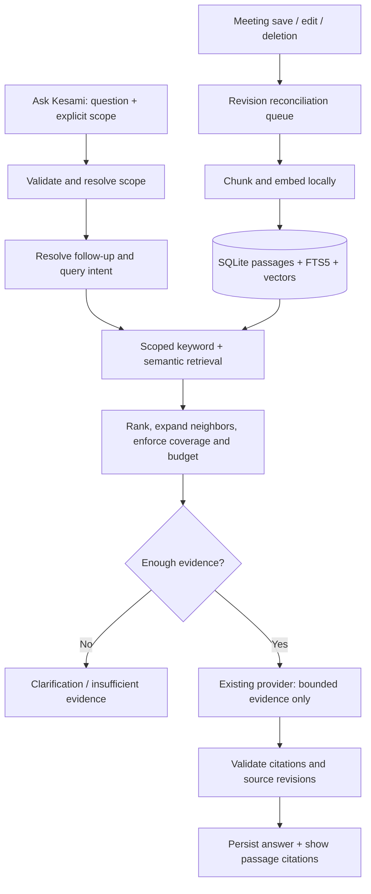

# Meeting chat with selective retrieval

Status: architecture baseline; initial implementation is described in [MEETING-CHAT.md](MEETING-CHAT.md). Proposed release gates below are targets unless the implementation notes say they were measured.
Date: 2026-09-06.

## Outcome and boundaries

Ask Kesami should answer questions about one meeting, selected meetings, a folder, or the complete library. Answers must cite the actual passages used, support follow-up questions, and clearly identify missing evidence. Retrieval and indexing run locally; only a bounded evidence packet reaches the configured answer provider.

The first release targets completed meetings. Live transcript indexing, autonomous actions, web search, and remote vector services are outside this release. Existing recording, summarization, and meeting file formats remain compatible. This proposal changes the chat data path; it does not redesign the existing meeting-summary generation path.

## Findings in this worktree

- `apps/ui/src/components/WorkspaceView.jsx` already has meeting selection and an Ask Kesami panel. It stores history in component state and uses the first 12 visible meetings when no explicit selection exists. The meeting history hook loads at most 200 meetings, so that list cannot define library-wide search.
- `apps/core-backend/src/workspace.rs::chat_prompt` serializes transcripts, summaries, notes, decisions, and actions into a shared 100,000-character allowance. It keeps the beginning and end when content overflows. There is no relevance retrieval, and a relevant passage in the middle can disappear.
- `POST /api/chat` accepts `{ question, meetingIds, messages }` and returns `{ answer, citations }`. Citations identify meetings, not passages.
- `summarizer.rs::answer` already supports Gemini and Claude CLI, structured output, and instructions treating sources/history as untrusted. Preserve provider selection and credential handling.
- `Store` in `main.rs` holds meetings in memory and persists via `library.rs` to individual `meeting.json` files. Legacy `meetings.json` import remains present. Transcript turns already contain IDs, speakers, language, and millisecond ranges.
- The HTTP implementation buffers complete JSON responses. Existing `/ws` is shared with meeting events. Token streaming is not already available for chat.
- `RecordingPlayer.jsx` already seeks to transcript turns using a recording offset; citation navigation must reuse this conversion.

## Architecture decision

Use hybrid RAG in the Rust backend, with an explicit bounded workflow. RAG selects evidence; LangGraph orchestrates workflow. LangGraph alone would not solve the current context selection problem. Its documented features include durable execution and human-in-the-loop orchestration, which are unnecessary for this first read-only chat flow. A JS/Python orchestration sidecar would add packaging and lifecycle work to the current Rust service. Keep module boundaries that would allow a later LangGraph orchestrator to call retrieval tools without owning meeting storage. [LangGraph documentation](https://docs.langchain.com/oss/javascript/langgraph/overview)

| Concern | Proposed choice | Reason / tradeoff |
| --- | --- | --- |
| Source of truth | Existing meeting library | No meeting-storage migration |
| Derived search index | SQLite via `rusqlite`, bundled FTS5 | Local, transactional, rebuildable; adds a native dependency |
| Keyword retrieval | FTS5 BM25 over passage text and metadata | Exact names, dates, acronyms, and quoted phrases |
| Semantic retrieval | Local embeddings through a small `Embedder` interface; FastEmbed candidate | Paraphrases and multilingual retrieval; model download and memory cost |
| Vector storage/search | Versioned float vectors in SQLite; scoped cosine scoring on a worker | Simple initial deployment; benchmark before choosing ANN for larger libraries |
| Ranking | Reciprocal rank fusion, overlap removal, evidence diversity | Combines lexical and semantic ranks without assuming comparable scores |
| Answer generation | Existing Gemini / Claude provider selection | Reuse credentials and error handling; dedicated chat prompt/schema |
| Threads | Separate persistent SQLite chat database | Conversations survive navigation; not disposable with the search index |

FTS5 supports full-text matching and BM25; its better BM25 matches have numerically lower scores. Keep that ordering explicit when producing ranked lists. [SQLite FTS5](https://www.sqlite.org/fts5.html)

FastEmbed documents local ONNX inference and offline use after model download. Its inference is synchronous, so run it on a dedicated bounded worker, never on the async recording path. Select and pin a multilingual model, tokenizer, dimensions, license, and artifact checksum after an English/Hindi/code-switch evaluation and macOS packaging spike. Do not assume the default English model is sufficient. Lexical search remains available if the model is missing, with a visible degraded-search state; there is no cloud embedding fallback. [FastEmbed Rust documentation](https://docs.rs/fastembed/latest/fastembed/)

## Index and lifecycle

Store the new databases in the resolved library's hidden application directory, e.g. `<library>/.kesami-chat/search.sqlite` and `threads.sqlite`. Configure explicit absolute paths and isolate libraries. Use owner-only files/directory permissions where supported, ignore runtime files, and never put data or model caches in the repository. The search database is disposable; thread history is user data. A search rebuild must never delete threads.

Logical tables:

- `indexed_meetings(meeting_id, content_revision, metadata_revision, generation, status, indexed_at, error_code)`: tracks current/pending/failed indexing.
- `chunks(chunk_id, meeting_id, content_revision, kind, ordinal, text, turn_ids, start_ms, end_ms, speaker_labels, language, provenance)`: immutable passages within a revision; `kind` distinguishes transcript, user note, summary, decision, and action.
- `chunk_fts`: FTS5 projection with passage text, title, and speaker labels, updated transactionally with chunks.
- `embeddings(chunk_id, model_id, model_revision, dimension, vector)`: reject incompatible dimensions/model versions; never mix embedding spaces.
- `index_jobs(meeting_id, desired_revision, state, attempts)`: coalesced jobs; retry limits and startup reconciliation recover missed notifications.
- Separate thread DB: `threads(id, scope_json, created_at, updated_at)` and `messages(id, thread_id, request_id, role, content, status, evidence_manifest, created_at)`; unique request IDs prevent duplicate messages on retry.

Chunking starts around 250–400 embedding tokens with 40–60 tokens of overlap, adjusted to the selected model's actual input limit. Group adjacent turns without losing speaker boundaries; split oversized turns at sentences and retain turn ID plus character offsets. Never embed an entire long meeting as one document. Keep notes and derived summaries separate from transcript passages. Preserve exact original text for quotes; normalization is only for search. Chunk IDs hash meeting ID, revision, source kind, offsets, and chunker version.

Use a content hash over searchable fields to avoid re-embedding unchanged text. Metadata-only changes (title/folder) update filters and FTS metadata; speaker changes refresh affected passages. Treat generated summaries/actions as derived sources, not independent corroboration. A timestamp is valid only when backed by an actual turn or timestamped note; never invent one for a summary.

On a successful durable meeting save, enqueue the desired revision. Final transcript replacement, notes edits, regenerated summaries, and speaker renames all trigger reconciliation. Do not embed on each audio packet or block saving on indexing. Take immutable snapshots under short store locks, then release them before disk/CPU/provider work. Limit worker concurrency and give recording/transcription priority.

Build a new meeting generation transactionally and publish only if its revision is still current. Query-time validation compares indexed revisions to current store revisions. Exclude stale passages, including after a crash between source save and queue update; show partial/indexing status instead of silently answering from stale content. Startup and periodic reconciliation compare source hashes and repair pending work. Search index migration builds a replacement index and swaps it after validation.

Deletion immediately excludes a missing meeting via source-store validation and queues index cleanup; a slow embedding job cannot republish it. Check membership and revisions again immediately before provider dispatch and before returning an answer. Content already sent to a provider cannot be recalled if a meeting is deleted mid-request. Existing conversation text remains conversation history, while deleted-source citations become unavailable and are excluded from future evidence/history context. Provide explicit thread deletion; do not silently erase user conversations when a meeting is deleted.

## Retrieval and answer workflow

1. **Validate and freeze scope.** Resolve meeting IDs server-side, intersect with the requested folder/date filters, reject unknown IDs, and select completed meetings. Folder membership uses `metadata.collectionId`, not on-disk folder names. Never infer library scope from the UI's loaded or filtered list. A folder/all scope is re-resolved for each request; return the scope count and revision snapshot.
2. **Resolve the question.** Start with the question and bounded recent user turns. Resolve explicit references such as “that deadline” using thread context and previously cited source IDs. Re-retrieve original evidence for every follow-up. An optional query-rewrite model call receives at most 1,000 tokens of relevant conversation, zero meeting documents, and a constrained output schema; it cannot broaden scope. Ambiguous references return a clarification. Prior assistant text is context, never evidence.
3. **Choose retrieval intent.** Distinguish factual lookup, comparison, overview, and exhaustive structured listing. Use deterministic paths for explicit UI intents and simple patterns; ambiguous natural-language requests can use the bounded rewrite output. Resolve relative dates using the user's timezone, not server UTC assumptions.
4. **Retrieve locally.** Search FTS and semantic vectors independently inside the allowed meeting/revision set, initially up to 40 candidates each. For explicit comparisons, run retrieval per named meeting/subquestion so one meeting cannot crowd out another. For library-wide factual questions, search all eligible passages without an arbitrary first-N meeting cutoff. Metadata helps ranking but must not prune the sole relevant transcript passage.
5. **Fuse and select.** Fuse rank lists, collapse overlapping chunks, and select up to 12 passages under the evidence budget. Add neighboring turns when an answer depends on a pronoun, negation, correction, or question/answer boundary; expanded text counts toward the same limit. Optional local cross-encoder reranking is a later optimization requiring measured benefit.
6. **Check coverage.** Relevance scores are not probabilities. Calibrate abstention thresholds on fixtures; lack of a lexical hit alone is not proof of missing evidence. Allow one additional scoped retrieval attempt for uncovered comparison sides or alternate wording. If evidence remains weak, return an explicit insufficiency or partial-coverage result rather than feed whole transcripts to the model.
7. **Generate.** Assign request-local source numbers to selected passages and send only question, bounded thread context, source metadata, and those passages. The generation function accepts an `EvidencePacket`, never `Vec<Meeting>`. Treat transcript instructions as data, disallow tool execution, and require evidence-linked claims. Ordinary successful questions use one answer-model call; at most one optional rewrite call precedes it.
8. **Validate and persist.** Require well-formed structured output; every citation ID and inline reference must resolve to supplied evidence within scope. Reject fabricated IDs and invalid references instead of silently dropping them. This validates provenance, not semantic truth; support accuracy is evaluated separately. Recheck revisions, persist the result atomically, and return it. Invalid output gets a recoverable error rather than an unbounded repair loop.

Initial request limits (configuration defaults, to be measured): 4,000 question characters; 6,000 evidence tokens; 1,500 history tokens; 2,000 answer tokens; 60-second total deadline; one active request per thread and two global provider calls. The complete provider input, including system/schema/metadata, has a 10,000-token ceiling. Use the provider tokenizer/count endpoint when available, otherwise a conservative UTF-8-byte upper bound. Count the serialized payload, not characters or text alone. Truncate at passage/message boundaries and never drop the question or required attribution. Reject a payload that still exceeds the provider's context allowance.

### Comparisons, overviews, and “all” questions

Top-k retrieval cannot establish an exhaustive answer. “What changed between A and B?” requires evidence for both A and B, chronological labels, and explicit conflicting statements. “Summarize this folder” retrieves representative existing summaries/decisions with provenance and reports the meetings covered; transcript evidence is retrieved when detail is needed.

“List every action item” uses a scoped, paginated structured query over all stored action items, with source links; it does not use top-k retrieval to claim completeness. The currently flexible action-item data does not establish a reliable completion state: say “recorded action items” and mark status unknown unless explicit evidence supports open/completed. Do not infer completion from silence. Exhaustive extraction of unstored facts from every transcript is a separate batch workflow; v1 explains that limitation. Large overviews are labeled partial and invite narrower scope, without silently expanding model context.

## API compatibility and thread contract

Keep `POST /api/chat` working with its current request and `{ answer, citations }` response. Route it through the same RAG service; preserve existing validation limits for this legacy adapter. Extend citation objects additively with `chunkId`, `sourceKind`, `turnIds`, optional `startMs`/`endMs`, `excerpt`, and `sourceRevision`; retain `number`, `meetingId`, and `title`. Distinct passages from one meeting receive distinct citation numbers.

Add thread-oriented endpoints for the new UI:

| Endpoint | Contract |
| --- | --- |
| `POST /api/chat/threads` | `{ scope }` → thread; scope is tagged `meetings`, `folder`, or `all`, with optional date range |
| `GET /api/chat/threads` | Paginated thread summaries, without meeting content |
| `GET /api/chat/threads/:id/messages` | Paginated messages and citation availability |
| `POST /api/chat/threads/:id/messages` | `{ question, requestId }` → bounded answer, citations, coverage, retrieval mode |
| `DELETE /api/chat/threads/:id` | Delete that conversation |
| `POST /api/chat/threads/:id/requests/:requestId/cancel` | Best-effort cancellation; do not persist a late answer |
| `GET /api/chat/index/status` | Ready/pending/failed counts and local model availability |

Example scope: `{ "type": "meetings", "meetingIds": ["m1", "m2"] }`; folder scope uses `folderId`, including a defined `null` for unfiled. Scope is immutable per thread in v1: selecting another scope starts a new thread, preserving old history. New endpoints accept broader scope than the legacy 12-meeting adapter but still impose explicit request-size and resource limits.

Return additive `status` (`answered`, `partial`, `insufficient_evidence`, `clarification_required`) and `coverage` (eligible/indexed/retrieved meeting counts, missing comparison IDs, truncated flag). Use stable error codes for invalid scope, source changes, indexing failure, unavailable provider, cancellation, timeout, and rate limits. Do not expose provider raw errors or credentials. Keep request/response as buffered JSON initially; the UI shows “Searching meetings…” then a general working state without pretending token streaming exists. Actual stage/token streaming requires a separately designed request-scoped transport; do not broadcast private chat content on the shared meeting WebSocket.

## UI integration

Extract chat responsibilities from `WorkspaceView.jsx` into `MeetingChatPanel`, `ChatScopePicker`, `ChatMessage`, `CitationCard`, and `useMeetingChat`. All network access stays in `lib/backend.js`. The workspace opens folder/library threads; meeting detail opens a one-meeting thread. Selected-meeting chips, folder, or “All meetings” clearly show the active scope and server-reported eligible count.

Provide thread history, multiline composer, Enter to send / Shift+Enter for newline, retry, cancel, empty state, and indexing/provider states. Preserve the submitted question on failure. Abort/ignore late responses by thread and request ID when navigating or changing scope. Do not clear historical threads on checkbox changes. Keep the chat reachable and scrollable on narrow layouts, with keyboard labels and accessible status announcements.

Display citations as meeting title, date, source type, excerpt, and timestamp when available. Load the source meeting by ID even if absent from the current 200-item UI list. Opening a transcript citation highlights its turn(s); seeking a recording uses the existing recording offset conversion. For revised/deleted passages, show “Source changed” / “Source unavailable”; never jump to an unrelated replacement turn. Show coverage and “Keyword search only” when embeddings are unavailable. No invented confidence percentage.

## Implementation sequence and verification gates

1. **Foundation and packaging spike:** prove SQLite FTS5 and local multilingual embedding inference on supported desktop targets; pin artifacts and benchmark memory/download/startup. Establish synthetic English/Hindi/code-switch fixtures. If embeddings cannot ship, explicitly ship lexical-only mode as an intermediate milestone, not completed hybrid RAG.
2. **Index service:** chunking, source revisions, FTS/vector persistence, bounded workers, rebuild and deletion semantics. Test crash reconciliation and stale-job publication with temporary libraries.
3. **Retrieval service:** hybrid rank fusion, comparisons, structured action listing, budgets, coverage and abstention. Assert that evidence in the middle of a long meeting is found and unrelated passages are excluded.
4. **Chat backend:** typed evidence packet, existing-provider adapter, citation validation, threads, request idempotency, cancellation and compatibility route. A capture/mock provider must prove that only chosen passages reach the generation boundary; no real credentials or user meetings are test fixtures.
5. **UI integration:** scoped threads, follow-ups, citation navigation and source availability. Verify reload persistence, keyboard/mobile layout, retry, cancellation and late-response handling.
6. **Release evaluation:** backend tests, UI build, focused UI/integration tests, and desktop smoke testing of source navigation while recording continues. Run `npm run test:backend`, `npm run build:ui`, and applicable new focused tests. Tests exercising startup must point data and library environment variables at temporary directories so the normal library is neither imported nor overwritten.

Non-negotiable automated checks: zero out-of-scope/stale passages sent; token budget always enforced; no model call on deterministic empty-evidence paths; no fabricated citation accepted; index rebuild preserves source files and threads; deletion and edits cannot resurrect stale passages; provider timeout/cancellation releases concurrency permits.

Build a labeled synthetic question set including paraphrases, exact names, middle passages, negation, conflicting dates, comparisons, unknown answers, prompt injection in transcripts, follow-ups after scope changes, more than 12/200 meetings, and multilingual questions. Proposed quality gate: supporting-passage recall@12 of at least 90% on answerable fixtures and complete reference resolution for every returned citation. Separately review whether claims are actually supported and whether unanswerable questions abstain. These are targets, not measured results.

Benchmark warm retrieval at 10,000 and 100,000 chunks, with a provisional p95 target below one second on a documented reference Mac. Measure full scoped cosine scans, indexing RSS, and recording/transcription responsiveness. Introduce an ANN index only if these measurements justify its packaging/maintenance cost. Record counts, timings, token usage and error codes without logging questions, passage text, credentials, or model prompts.

## Remaining implementation decisions

- Exact multilingual embedding model/runtime and supported-platform packaging: resolve in the first spike; requires measured quality and license review.
- Final token/candidate limits and vector-scan scale threshold: tune using fixtures and hardware measurements.
- True answer streaming and exhaustive whole-library transcript analysis: later capabilities with their own bounded-job design.

This document remains the design baseline. The implementation uses the existing Rust service and preserves meeting formats. Consult [MEETING-CHAT.md](MEETING-CHAT.md) for shipped behavior, conservative byte-based context limits, model details, verification commands, and remaining release-validation work.
